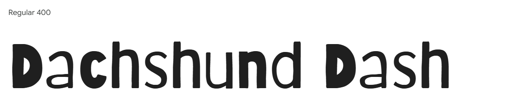
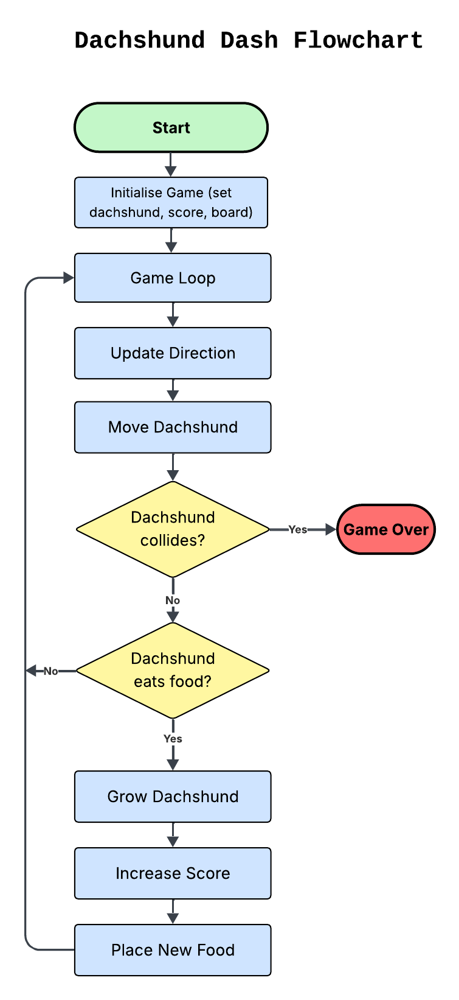

# team2-imposter-quiz
[View the Live Project here]()

# Table of Content
- [User Expeience](#user-experience)
    - [Project Goals](#project-goals)
    - [User Stories](#user-stories)
    - [Design Choices](#design-choices)
    - [Wireframes](#wireframes)
- [Game Logic](#game-logic)    
- [Features](#features)
- [Technologies and Tools Used](#technologies-and-tools-used)
- [Code](#code)
- [Testing](#testing)
    - [Bugs](#bugs)
    - [Unresolved Bugs](#unresolved-bugs)
    - [Tesing User Stories](#testing-user-stories)
    - [Manual Testing](#manual-testing)
    - [Automated Testing](#automated-testing)
    - [Accessibility](#accessibility)
- [Deployment](#deployment)
- [Maintenance & Updates](#maintenance--updates)
- [Credits](#credits)

## User Experience

### Project Goals

The primary goal of Dachshund Dash is to create an engaging and accessible web-based game designed for players aged 5 and above. The game is intended to offer light entertainment, improve concentration and reaction time, and provide a playful experience through a charming dachshund-themed design.
This project also aims to serve as a learning exercise for front-end development techniques, including responsive web design, JavaScript logic for interactive gameplay, and visual asset creation.

Business Objectives:
-	Deliver a game that can offer both casual entertainment and short play sessions — ideal for quick breaks, commutes, or family playtime.
-	Ensure compatibility with both desktop (keyboard-controlled) and mobile (touch-controlled) devices.
-	Design a flexible game flow to accommodate players of varying ages, with planned difficulty levels (Easy / Hard) to broaden appeal.
-	Create a child-safe, visually appealing design using friendly dachshund-themed assets to capture players’ interest.
-	Develop clear, professional documentation to present the project structure and development process to potential employers or collaborators.

### User Stories

- User Story 1:

  As a casual player, I want a quick and fun game I can play during short breaks when sitting at my desk, so I can relax my mind without commitment.

- User Story 2:

  As a commuter, I want a game I can easily play on my mobile during journeys, so I can enjoy it until I reach my destination.

- User Story 3:

  As an experienced gamer, I want the game to run smoothly without glitches, so I can enjoy a professional and frustration-free experience.

- User Story 4:

  As a parent, I want a simple and child-friendly game for my 5-year-old to enjoy during car journeys, so they can stay entertained and safe.

- User Story 5:

  As a potential player, I want a game with interesting and appealing design, so I can enjoy the experience visually as well as through gameplay.

- User Story 6:

  As a teenager, I want the game to offer different levels of difficulty so I don’t get bored and can stay challenged over time.

- User Story 7:
  As a playful person, I want funny sound effects to make the game feel lively and entertaining.

The project's **Kanban Board** can be viewd [here](https://github.com/users/dagmara-szproch/projects/7/views/2)

### Design Choices

#### Colour Scheme
The colour choices were made with clarity, contrast, and a playful tone in mind:

- Header and footer: rgba(0, 0, 0, 0.6) provides a slightly transparent, dark overlay that makes the text and icons stand out without being too harsh.

- Game board: #f5f0e1 – a soft beige colour that is gentle on the eyes and contrasts nicely with both the dachshund and food items.

#### Fonts

For the main heading and playful elements of the game, I chose the **Barriecito** font from [Google Fonts](https://fonts.google.com/). It has a fun, hand-drawn look that fits the light-hearted and friendly tone of the game, especially considering the target audience of younger players.

#### Icons

I used [Font Awesome](https://fontawesome.com/) icons to enhance interactivity and clarity:

- Sound and music controls feature easily recognisable speaker and music icons.

- Footer links include icons for GitHub and LinkedIn, helping to visually guide users to professional and project-related resources.

#### Images
All images used in the project were sourced from Pixabay, which offers free-to-use illustrations:

- Game background: [Dachshund Drawing](https://pixabay.com/illustrations/dachshund-dog-animal-pet-drawing-8707182/)

- Favicon and in-game dachshund character: [Dachshund Drawing](https://pixabay.com/illustrations/dachshund-dog-animal-pet-drawing-8707181/)

These illustrations add a warm and friendly aesthetic that supports the theme of a dachshund-themed game.

### Wireframes

## Game Logic

### Development Roadmap

#### Stage 1: Core Logic Prototype

-	Create the game grid.
-	Build the snake movement logic in JavaScript.
-	Implement food spawning and food-eating logic.
-	Make the snake grow after eating food.
-	Detect collisions with the walls or with itself (trigger game over).
-	Add basic keyboard controls (arrow keys).
-	Implement a scoring system and allow restarting the game.

**Goal:** The game is fully playable using simple coloured squares — no graphics yet.

Stage 1 focuses on core functionality.
In this stage, I will focus on building the fundamental parts of the game: grid generation, movement logic, and collision detection.
To achieve this, I will implement the following functions and components:

- Core game variables (to store game state such as snake position, direction, food, etc.)

- createGameBoard() — to dynamically generate the game grid.

- moveSnake() — to handle the movement of the snake.

- checkCollision() — to detect collisions with walls or the snake itself.

- generateFood() — to randomly place food on the board.

- Keyboard controls — using an eventListener to capture user input.

- gameLoop() — the main function that updates the game state at regular intervals.

[stage 1 functions and components](docs/function-stage1.png)

#### Stage 2: Mobile Touch Support

-	Create on-screen arrow buttons or add swipe gesture controls.
-	Adjust the game board size for smaller screens.
-	Ensure touch buttons are large enough and comfortably spaced for fingers.
-	Test functionality across different mobile and tablet devices.

**Goal: Smooth gameplay experience on both desktop and mobile**

#### Stage 3: Game Menus and Enhancements

-	Add a start screen, game over screen, and pause functionality.
-	Implement basic sound effects (e.g., food eaten, game over) and background music.
-	Introduce two difficulty levels: Easy and Hard, with adjustable speed.
-	Integrate existing header buttons (e.g., sound/music toggles) properly into the game flow.

**Goal: A more polished, interactive experience with sound and basic game settings**

#### Stage 4: Visual Design — Dachshund Theme

-	Design and prepare dachshund images (head, body, tail).
-	Optionally, create a "turn" piece for smoother movement visuals.
-	Replace simple blocks with dachshund images.
-	Implement image rotation to match movement direction (so the dog "turns" properly).
-	Replace the food block with a bone emoji or a bone image.
-	Fine-tune image sizing so everything fits the grid cleanly.

**Goal: Same gameplay, but visually transformed with charming dachshund graphics**

#### Stage 5: Future Improvements

-	Add more detailed animations (e.g., wagging tail when eating food).
-	Include a high score system stored locally.
-	Implement a settings panel (mute music, reset game, theme toggle).
-	Create special bonus items (speed boosts, extra points).
-	Polish responsive design even further for various screen sizes.
-	Improve accessibility (keyboard navigation, better colour contrast).

**Goal: Continue enhancing gameplay, visuals, and usability based on feedback and testing**

### Game flowchart

## Features

## Technologies and Tools Used

## Code

## Testing

### Bugs

### Unresolved Bugs

### Testing User Stories

### Manual Testing

### Automated Testing

### Accessibility

## Deployment

## Maintenance & Updates

## Credits

### Content

### Media

- [Dachshund Drawing](https://pixabay.com/illustrations/dachshund-dog-animal-pet-drawing-8707181/)
- [Dachshund Drawing](https://pixabay.com/illustrations/dachshund-dog-animal-pet-drawing-8707182/)
