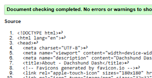
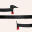

# Dachshund Dash

View the Live Project [here](https://dagmara-szproch.github.io/dachshund-dash-game/)

# Table of Content
- [User Expeience](#user-experience)
    - [Project Goals](#project-goals)
    - [User Stories](#user-stories)
    - [Design Choices](#design-choices)
    - [Wireframes](#wireframes)
- [Game Logic](#game-logic)    
- [Features](#features)
- [Technologies and Tools Used](#technologies-and-tools-used)
- [Code](#code)
- [Testing](#testing)
    - [Bugs](#bugs)
    - [Unresolved Bugs](#unresolved-bugs)
    - [Tesing User Stories](#testing-user-stories)
    - [Manual Testing](#manual-testing)
    - [Automated Testing](#automated-testing)
    - [Accessibility](#accessibility)
- [Deployment](#deployment)
- [Maintenance & Updates](#maintenance--updates)
- [Credits](#credits)

## User Experience

### Project Goals

The primary goal of Dachshund Dash is to create an engaging and accessible web-based game designed for players aged 5 and above. The game is intended to offer light entertainment, improve concentration and reaction time, and provide a playful experience through a charming dachshund-themed design.
This project also aims to serve as a learning exercise for front-end development techniques, including responsive web design, JavaScript logic for interactive gameplay, and visual asset creation.

Business Objectives:
-	Deliver a game that can offer both casual entertainment and short play sessions — ideal for quick breaks, commutes, or family playtime.
-	Ensure compatibility with both desktop (keyboard-controlled) and mobile (touch-controlled) devices.
-	Design a flexible game flow to accommodate players of varying ages, with planned difficulty levels (Easy / Hard) to broaden appeal.
-	Create a child-safe, visually appealing design using friendly dachshund-themed assets to capture players’ interest.
-	Develop clear, professional documentation to present the project structure and development process to potential employers or collaborators.

### User Stories

- User Story 1:

  As a casual player, I want a quick and fun game I can play during short breaks when sitting at my desk, so I can relax my mind without commitment.

- User Story 2:

  As a commuter, I want a game I can easily play on my mobile during journeys, so I can enjoy it until I reach my destination.

- User Story 3:

  As an experienced gamer, I want the game to run smoothly without glitches, so I can enjoy a professional and frustration-free experience.

- User Story 4:

  As a parent, I want a simple and child-friendly game for my 5-year-old to enjoy during car journeys, so they can stay entertained and safe.

- User Story 5:

  As a potential player, I want a game with interesting and appealing design, so I can enjoy the experience visually as well as through gameplay.

- User Story 6:

  As a teenager, I want the game to offer different levels of difficulty so I don’t get bored and can stay challenged over time.

- User Story 7:
  As a playful person, I want funny sound effects to make the game feel lively and entertaining.

The project's **Kanban Board** can be viewd [here](https://github.com/users/dagmara-szproch/projects/7/views/2)

### Design Choices

#### Colour Scheme

The colour choices were made with clarity, contrast, and a playful tone in mind:

- Header and footer: rgba(0, 0, 0, 0.6) provides a slightly transparent, dark overlay that makes the text and icons stand out without being too harsh.

- Game board: #f5f0e1 – a soft beige colour that is gentle on the eyes and contrasts nicely with both the dachshund and food items.

#### Fonts

For the main heading and playful elements of the game, I chose the **Barriecito** font from [Google Fonts](https://fonts.google.com/). It has a fun, hand-drawn look that fits the light-hearted and friendly tone of the game, especially considering the target audience of younger players.

#### Icons

I used [Font Awesome](https://fontawesome.com/) icons to enhance interactivity and clarity:

- Sound and music controls feature easily recognisable speaker and music icons.

- Footer links include icons for GitHub and LinkedIn, helping to visually guide users to professional and project-related resources.

#### Images
All images used in the project were sourced from Pixabay, which offers free-to-use illustrations:

- Game background: [Dachshund Drawing](https://pixabay.com/illustrations/dachshund-dog-animal-pet-drawing-8707182/)

- Favicon and in-game dachshund character: [Dachshund Drawing](https://pixabay.com/illustrations/dachshund-dog-animal-pet-drawing-8707181/)

These illustrations add a warm and friendly aesthetic that supports the theme of a dachshund-themed game.

### Wireframes

## Game Logic

### Development Roadmap

#### Stage 1: Core Logic Prototype

-	Create the game grid.
-	Build the snake movement logic in JavaScript.
-	Implement food spawning and food-eating logic.
-	Make the snake grow after eating food.
-	Detect collisions with the walls or with itself (trigger game over).
-	Add basic keyboard controls (arrow keys).
-	Implement a scoring system and allow restarting the game.

**Goal:** The game is fully playable using simple coloured squares — no graphics yet.

Stage 1 focuses on core functionality.
In this stage, I will focus on building the fundamental parts of the game: grid generation, movement logic, and collision detection.
To achieve this, I will implement the following functions and components:

- Core game variables (to store game state such as snake position, direction, food, etc.)

- createGameBoard() — to dynamically generate the game grid.

- moveSnake() — to handle the movement of the snake.

- checkCollision() — to detect collisions with walls or the snake itself.

- generateFood() — to randomly place food on the board.

- Keyboard controls — using an eventListener to capture user input.

- gameLoop() — the main function that updates the game state at regular intervals.

[stage 1 functions and components](docs/function-stage1.png)

#### Stage 2: Mobile Touch Support

-	Create on-screen arrow buttons or add swipe gesture controls.
-	Adjust the game board size for smaller screens.
-	Ensure touch buttons are large enough and comfortably spaced for fingers.
-	Test functionality across different mobile and tablet devices.

**Goal: Smooth gameplay experience on both desktop and mobile**

#### Stage 3: Game Menus and Enhancements

-	Add a start screen, game over screen, and pause functionality.
-	Implement basic sound effects (e.g., food eaten, game over) and background music.
-	Introduce two difficulty levels: Easy and Hard, with adjustable speed.
-	Integrate existing header buttons (e.g., sound/music toggles) properly into the game flow.

**Goal: A more polished, interactive experience with sound and basic game settings**

#### Stage 4: Visual Design — Dachshund Theme

-	Design and prepare dachshund images (head, body, tail).
-	Optionally, create a "turn" piece for smoother movement visuals.
-	Replace simple blocks with dachshund images.
-	Implement image rotation to match movement direction (so the dog "turns" properly).
-	Replace the food block with a bone emoji or a bone image.
-	Fine-tune image sizing so everything fits the grid cleanly.

**Goal: Same gameplay, but visually transformed with charming dachshund graphics**

#### Stage 5: Future Improvements

-	Add more detailed animations (e.g., wagging tail when eating food).
-	Include a high score system stored locally.
-	Implement a settings panel (mute music, reset game, theme toggle).
-	Create special bonus items (speed boosts, extra points).
-	Polish responsive design even further for various screen sizes.
-	Improve accessibility (keyboard navigation, better colour contrast).

**Goal: Continue enhancing gameplay, visuals, and usability based on feedback and testing**

### Game flowchart

## Features

- Responsive Design

Playable on both desktop and mobile devices, with swipe controls for mobile and keyboard controls for desktop.

- Game Over Screen

Displays your final score.

- Touch-Friendly Swipe Area

A dedicated swipe zone appears on mobile screens for smooth and intuitive gameplay.

- Dynamic Board Size

The grid automatically adjusts:

20×20 for larger screens (desktops, laptops)

15×15 for smaller screens (mobiles, tablets)

## Technologies and Tools Used

- HTML, CSS and JavaScipt were used as the languages.
- [Font Awesome](https://fontawesome.com/) to incorporate icons.
- [Google Fonts](https://fonts.google.com/) to import fonts.
- [Birme](https://www.birme.net/) to resize, compress and change the image format to WEBP.
- [Pixabay](https://pixabay.com/) to downland the images for the background and favicons.
- [Open AI](https://openai.com/chatgpt/overview/) to review the content for spelling, grammar and consistency and generate some function.
- [CSS Validator](https://jigsaw.w3.org/css-validator/) to test style.css
- [HTML Validator](https://validator.w3.org/) Markup Validation Service
- Lighthouse Chrome Dev Tools for testing.
- [GitHub](https://github.com/) to store my project and the project board.
- [Git](https://git-scm.com/) for version control.
- [Am I responsive](https://ui.dev/amiresponsive) for mock ups.

## Code

Before I started coding (in fact, even before completing the module), I watched several YouTube tutorials, which gave me my first impressions of the classic Snake game.
Over the following week or two, the idea for my dachshund-themed version gradually took shape.

Throughout the planning stage, I frequently consulted ChatGPT to check whether certain solutions were possible in JavaScript, or whether there were alternative approaches to those presented in the tutorials.

However, when I began the actual coding process, it became clear that implementing my original idea was more challenging than I had initially expected.
In particular, creating on-screen control buttons for mobile devices (where responsiveness was essential) proved too complex within the time available. As a result, I decided — at the last moment — to switch to a swipe-based control system.

To achieve the desired behaviour, I used AI assistance to help design and generate a function that handles the touchstart and touchmove event listeners effectively.
I also relied on AI support to validate my generateFood function, ensuring that food would not be placed on any existing dachshund segments.
Additionally, the draw() function was incorporated to update the game's visual elements.

- [How to code snake game in JavaScript](https://www.youtube.com/watch?v=baBq5GAL0_U)
- [Coding Snake in JavaScript](https://www.youtube.com/watch?v=7Azlj0f9vas&t=874s)
- [Beginner JavaScript Project – Snake Game Tutorial](https://www.youtube.com/watch?v=uyhzCBEGaBY&t=1896s)
- [A game of Snake written in JavaScript](https://www.youtube.com/watch?v=Je0B3nHhKmM&t=973s)
- [How To Code The Snake Game In Javascript](https://www.youtube.com/watch?v=QTcIXok9wNY)
- [Documentation regarding touch events](https://developer.mozilla.org/en-US/docs/Web/API/Touch_events)

## Testing

### Bugs

### Unresolved Bugs

Known Issues

The game is not fully optimised for landscape orientation on mobile devices. Due to limited screen height in landscape mode, there isn't sufficient space to properly display the game board, swipe area, and controls. As a result, gameplay is recommended in portrait mode for the best experience.

### Testing User Stories

### Manual Testing

#### Stage 1 Testing

#### Stage 2 Testing

My initial intention for Stage 2 was to design clickable control buttons for mobile users. Unfortunately, after many trials and errors, I decided to abandon this idea. It was difficult to design buttons that were comfortable for players, both in terms of size and positioning on the screen. As an alternative, I chose to implement swipe functionality, which may actually be an even better solution, as users are already very familiar with swiping gestures on mobile devices.

With the help of AI, I successfully added the swipe feature and removed the original control buttons. However, several new issues appeared. Firstly, I encountered a typo: I mistakenly used getSizeBoard instead of getBoardSize, which led to problems with variables and the order of their initialisation. Once corrected, further testing revealed that my swipe code was initially limited to only work within the game board area, which felt very uncomfortable when playing. I addressed this by extending the swipe detection to the **main** area, creating a much better experience.

Another challenge arose when the restart button became sensitive to swipe gestures. Initially, I tried an AI-generated function to prevent this behaviour, but as it did not work correctly, I decided to move the restart button to the header. This change actually simplified the code, improving both functionality and structure.

The only remaining issue is that the footer does not stick perfectly to the bottom of the screen. However, I have decided to leave styling improvements for Stage 3, where I will focus on making the game visually appealing.

#### Stage 2 and 3 Testing

During the next stage, I improved the style of my game. I added a background image, fixed the footer so that it remains at the bottom, and improved the design for mobile devices.
I also corrected the layout for laptops with smaller screen heights; previously, it was impossible to see the header (with buttons and scores) and the game board at the same time, which made for a very poor user experience.

Additionally, I redesigned the swipe area. Initially, the JavaScript function wasn’t working properly — when the game was not running, I couldn't swipe up or down, meaning it was almost impossible to access the footer. In fact, I could do it only by swiping in a very specific spot (the header area), which was not intuitive at all.
Now, the swipe area is positioned just below the game board, and I added a message saying "Swipe to Dash!" to inform players what to do.
This swiping feature is designed specifically for mobile devices (screen width less than 768px).

I am still a bit confused about larger devices like tablets, where there is no keyboard. I can't physically test the game on such devices because I do not own one.
I am aware there is still a bug when mobiles are in landscape orientation; I am leaving that for future improvement, as I currently do not know how to resolve it.

In the next step, I could add some text for players, such as: "Please rotate your device back to portrait mode for the best experience!"

### Automated Testing

### Accessibility

- I used meaningful alt text for images.

- I implemented semantic HTML elements such as header, main, and section for better structure and navigation.

- I ensured that all clickable elements are proper button elements instead of div or span.

- I maintained sufficient contrast between the background and content for readability.

## Deployment

The website was deployed using GitHub Pages, which provides a simple way to host static websites directly from a GitHub repository. Below are the steps taken to deploy the project:

1. Repository Setup
- The project files were uploaded to a GitHub repository.
- The main branch was used for deployment.

2. Enabling GitHub Pages
- In the repository settings, GitHub Pages was enabled.
- The source branch was set to main.
- The deployment was configured to serve files from the root directory.
3. Accessing the Live Website
- Once the deployment process was completed, the website became accessible at the provided GitHub Pages URL.
- The link to the deployed site: https://github.com/dagmara-szproch/dachshund-dash-game

4. Updating the Website
- Any changes pushed to the main branch automatically update the live website.
- Regular updates are made using Git commits and pushes.

## Maintenance & Updates

While the core version of Dachshund Dash is fully playable, there are several planned enhancements that were not yet implemented due to time constraints. These ideas aim to improve gameplay, design, and user experience:

- Game Menus and Controls

  - Add a start screen, pause functionality, and more polished game over screen.

  - Integrate sound effects (e.g., eating food, game over) and background music.

  - Introduce difficulty settings (Easy/Hard) with adjustable game speed.

  - Properly connect header buttons (e.g., sound/music toggles) into the game flow.

- Visual Enhancements — Dachshund Theme

  - Replace simple snake blocks with dachshund body parts (head, body, tail) for a more charming appearance.

  - Implement image rotation based on movement direction for smoother turns.

  - Use a bone emoji or custom bone image as the food item.

  - Fine-tune image sizes to fit the game grid seamlessly

- Responsive Design and Accessibility

  - Further polish responsiveness for a wide range of screen sizes.

  - Improve accessibility with better colour contrast and full keyboard support.

## Credits

The dachshund illustrations (background and favicon) were created by BiancaVanDijk and sourced from Pixabay.

- [Dachshund Drawing](https://pixabay.com/illustrations/dachshund-dog-animal-pet-drawing-8707181/)
- [Dachshund Drawing](https://pixabay.com/illustrations/dachshund-dog-animal-pet-drawing-8707182/)

Styling support and some content assistance were provided by ChatGPT.